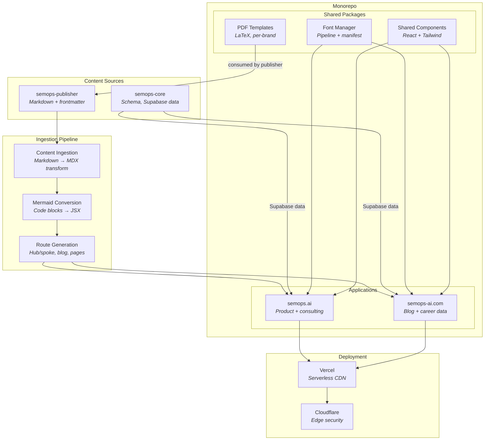

# semops-sites

Content delivery, web publishing, and design system for the [SemOps](https://semops.ai) organization. Two websites, a shared component library, and the ingestion pipeline that turns authored Markdown into deployed pages.

## What This Is

The SemOps system has three layers: a domain-agnostic core engine ([semops-core](https://github.com/semops-ai/semops-core), [semops-data](https://github.com/semops-ai/semops-data), [semops-dx-orchestrator](https://github.com/semops-ai/semops-dx-orchestrator)), domain applications built on that engine, and agentic operations. This repo is the delivery half of the [Digital Asset Management](https://en.wikipedia.org/wiki/Digital_asset_management) (DAM) pipeline. Where [semops-publisher](https://github.com/semops-ai/semops-publisher) owns content creation (AI writing agents, style governance, editorial quality), this repo owns what happens after content is finished: ingestion, transformation, rendering, and deployment to public web surfaces.

The repo is a monorepo containing two Next.js applications, a shared design system, and the infrastructure that connects them:

1. **Two websites.** [semops.ai](https://semops.ai) (product and consulting) and [semops-ai.com](https://semops-ai.com) (personal brand, blog, career data). Each is an independent Next.js application that shares fonts, components, and design tokens through the monorepo's package layer.
2. **Content ingestion pipeline.** An automated transform that takes Markdown with YAML frontmatter (the [content manifest](https://github.com/semops-ai/semops-dx-orchestrator)) from semops-publisher and converts it to MDX with JSX components, site routing, and surface-specific metadata. The pipeline handles frontmatter field mapping, Mermaid diagram conversion, relative link resolution, and hub/spoke page routing.
3. **Design system.** Centralized ownership of visual assets shared across the SemOps organization: a font management pipeline (acquisition, conversion, manifest-driven metadata with auto-generated CSS), PDF export templates (LaTeX with per-brand typography), and reusable React components. Other repos consume these assets but do not own them.

This repo and [semops-publisher](https://github.com/semops-ai/semops-publisher) together form the two halves of the DAM pipeline. Publisher owns the creation side: editorial voice, style governance, content quality, and the writing agents that produce artifacts. Sites owns the delivery side: MDX transforms, routing, design system, and the web surfaces where content is rendered. The [content manifest](https://github.com/semops-ai/semops-dx-orchestrator) is the contract between them. Publisher produces clean Markdown with content-level metadata (title, author, style guide, audience tier). Sites handles everything from that point forward (layout, components, SEO, deployment). Neither repo needs to understand the other's internals, but they co-evolve as a [Partnership](https://github.com/semops-ai/semops-dx-orchestrator#how-repos-integrate): shared artifacts like fonts, PDF templates, and content schemas are coordinated across both.

Part of the [semops-ai](https://github.com/semops-ai) organization. For system-level architecture and how all six repos relate, see [semops-dx-orchestrator](https://github.com/semops-ai/semops-dx-orchestrator).

**What this repo is NOT:**

- Not a content creation system — content is authored in [semops-publisher](https://github.com/semops-ai/semops-publisher), not here
- Not a CMS — content lives in Git, deployed via CI/CD, with no runtime content management
- Not concept documentation (see [semops-docs](https://github.com/semops-ai/semops-docs) for framework theory)

## How to Read This Repo

**If you want to understand the publishing pipeline end-to-end:**
Start with [What This Is](#what-this-is) for how Publisher and Sites split responsibilities, then see [Content Ingestion](#content-ingestion) for how Markdown becomes deployed web pages.

**If you want to understand the design system:**
The [Design System](#design-system) section explains how fonts, PDF templates, and shared components are organized and consumed across the organization.

**If you want to study the architecture and design decisions:**
The [Key Decisions](#key-decisions) section explains why content is git-based rather than CMS-managed, why server components are used over client-side rendering, and why design assets are centralized in one repo.

**If you're coming from the orchestrator and want implementation depth:**
This repo implements the Surface Deployment capability described in [semops-dx-orchestrator](https://github.com/semops-ai/semops-dx-orchestrator#repo-map). It consumes content from [semops-publisher](https://github.com/semops-ai/semops-publisher) and schema services from [semops-core](https://github.com/semops-ai/semops-core).

## Architecture

The monorepo uses npm workspaces with [Turborepo](https://turbo.build/) for build orchestration. Each application is independently deployable but shares design infrastructure through the package layer. Content flows in one direction: Publisher produces Markdown, the ingestion pipeline transforms it to MDX, and Vercel deploys the result.

## Content Ingestion

The ingestion pipeline is the mechanism that connects content creation to content delivery. It transforms authored Markdown from semops-publisher into MDX files ready for Next.js rendering.

The pipeline handles three content types, each with its own routing pattern:

| Content Type | Source (Publisher) | Transform | Destination (Sites) |
| ------------ | ------------------ | --------- | ------------------- |
| Blog posts | `posts/<slug>/final.md` | Frontmatter mapping, Mermaid → JSX | `content/blog/<slug>.mdx` |
| Pages | `content/pages/<hub>/` | Hub/spoke routing, relative links | `content/pages/<hub>/` |
| Whitepapers | `content/whitepapers/<slug>/` | Long-form MDX with citations | `content/whitepapers/<slug>.mdx` |

Each transform reads the content manifest (YAML frontmatter) to determine metadata, then applies surface-specific conversions: Mermaid code blocks become JSX components, relative Markdown links become site routes, and frontmatter fields are mapped to the site's content model. A dry-run mode previews transforms before writing.

Other publishing surfaces (LinkedIn, PDF, GitHub READMEs) bypass Sites entirely and use direct export from Publisher.

## Design System

The design system is organized as shared packages within the monorepo, consumed by both applications and by other repos in the organization.

**Fonts.** A self-contained font management pipeline that handles the full lifecycle from acquisition to deployment. Font archives (from sources like Envato Elements or Google Fonts) are imported, extracted to TrueType, compressed to WOFF2 for web delivery, and registered in a `fonts.json` manifest that serves as the single source of truth. The manifest tracks rich metadata per family: weight variants, category, designer, license, usage hints (body, heading, code, decorative), design tokens (line height, letter spacing), and recommended pairings. A key design property: human-curated metadata (descriptions, pairings, tags) is preserved across regeneration, so the manifest can be rebuilt from font files without losing editorial decisions. The pipeline also auto-categorizes fonts and infers design tokens from font characteristics. Per-brand typography is DM Sans and JetBrains Mono for the consulting brand, Inter and Lora for the personal brand, plus specialty fonts for visual design. CSS `@font-face` definitions are auto-generated from the manifest. Other repos consume these assets — semops-publisher uses the font files for PDF export via Pandoc and XeLaTeX.

**PDF templates.** LaTeX templates for whitepaper and document export, with per-brand typography baked in. These are owned by Sites but consumed by Publisher for PDF generation. The template defines layout, margins, headers, and font selections; Publisher supplies the content.

**Shared components.** Reusable React components and Tailwind CSS design tokens shared across both applications. This includes prose layout constraints (max-width 680px), syntax highlighting configuration, and data visualization components built with [Recharts](https://recharts.org/).

### Technology Stack

| Layer | Technology | Role |
| ----- | ---------- | ---- |
| Framework | [Next.js](https://nextjs.org/) (App Router) | React server-side rendering |
| Content | [MDX](https://mdxjs.com/) (next-mdx-remote) | Markdown with embedded React components |
| Styling | [Tailwind CSS](https://tailwindcss.com/), [ShadCN UI](https://ui.shadcn.com/) | Utility-first CSS with component library |
| Database | [Supabase](https://supabase.com/) (PostgreSQL) | Resume data, career dimensions, structured queries |
| Hosting | [Vercel](https://vercel.com/) | Serverless deployment with global CDN |
| Edge | [Cloudflare](https://www.cloudflare.com/) | DDoS protection, SSL/TLS, bot management |
| Diagrams | [Mermaid](https://mermaid.js.org/) | Diagrams-as-code, client-side rendering |
| Build | [Turborepo](https://turbo.build/) | Monorepo build orchestration |

## Key Decisions

### 1. Git-Based Publishing Over CMS

**Decision:** Store all content in Git and deploy via CI/CD rather than using a content management system.

**Why:** Content is authored in semops-publisher with AI writing agents and HITL editing. The editorial process is inherently version-controlled — drafts, outlines, and captured edits all live in Git. Adding a CMS would create a second source of truth for content that already has a well-defined home. Git-based publishing also means content changes are reviewable, diffable, and deployable through the same pull request workflow used for code.

**Trade-off:** No visual editing interface. Content authors work in Markdown and frontmatter, not a WYSIWYG editor. This is acceptable because the primary author is one person using AI agents, and the content manifest provides sufficient structure for the ingestion pipeline to handle formatting.

### 2. Server Components First

**Decision:** Default to React Server Components for all pages, with client-side JavaScript only where interactivity requires it.

**Why:** Most pages are content-heavy and read-only — blog posts, framework documentation, career timelines. Server Components render on Vercel's servers and send HTML to the browser, resulting in faster page loads and smaller JavaScript bundles. Client components are used selectively for interactive elements like data visualizations and navigation.

**Trade-off:** Development requires understanding the Server/Client component boundary. Some patterns that work naturally in client-side React (useEffect, useState) need restructuring for server rendering. The performance benefit is worth the development friction for a content-heavy site.

### 3. Centralized Design Assets

**Decision:** Own fonts, PDF templates, and shared components in one repo rather than distributing them across the organization.

**Why:** Design consistency requires a single source of truth. If fonts live in Publisher and templates live in Sites, they can drift out of sync. Centralizing in Sites means every consuming repo gets the same version. The monorepo's package structure makes cross-repo consumption explicit: Publisher's PDF export depends on `packages/pdf-templates/`, and that dependency is visible and version-trackable.

**Trade-off:** Sites becomes a dependency for repos that do not otherwise interact with frontend concerns. Publisher needs font files for PDF export even though it never renders a web page. This coupling is intentional — it enforces the ownership boundary. The alternative (copying fonts between repos) creates the sync problem that centralization solves.

## Status

| Component | Maturity | Notes |
| --------- | -------- | ----- |
| semops-ai.com | Stable | Personal brand, blog, career timeline deployed |
| semops.ai | Beta | Product site, framework documentation in progress |
| Blog ingestion | Stable | Markdown → MDX pipeline with frontmatter mapping |
| Page ingestion | Stable | Hub/spoke structure with relative link resolution |
| Whitepaper ingestion | Beta | Long-form MDX transform functional |
| Font manager | Stable | Full pipeline: ZIP import, WOFF2 conversion, manifest with preserved edits, auto-generated CSS |
| PDF templates | Stable | Per-brand LaTeX templates consumed by Publisher |
| Shared components | Beta | React components and Tailwind design tokens |
| Resume data pipeline | Beta | Dimensional schema in Supabase, career visualizations |
| Vercel deployment | Stable | Auto-deploy on push to main |

This is a single-person project in active development. The semops-ai.com site and content ingestion pipelines are stable, while semops.ai and the broader design system are maturing.

## References

### Related

- **[semops-dx-orchestrator](https://github.com/semops-ai/semops-dx-orchestrator)** — System architecture, cross-repo coordination, and design principles
- **[semops-publisher](https://github.com/semops-ai/semops-publisher)** — AI-assisted content creation (supplies content to this repo)
- **[semops-core](https://github.com/semops-ai/semops-core)** — Schema, knowledge graph, and shared infrastructure services
- **[semops-docs](https://github.com/semops-ai/semops-docs)** — Framework theory, concepts, and foundational research
- **[semops.ai](https://semops.ai)** — Framework concepts and the case for Semantic Operations
- **[semops-ai.com](https://semops-ai.com)** — Blog, thought leadership, and project narrative

### Influences

- **[DAM](https://en.wikipedia.org/wiki/Digital_asset_management)** (Digital Asset Management) — Content lifecycle, metadata governance, multi-surface delivery
- **[Jamstack](https://jamstack.org/)** — Git-based publishing, pre-rendering, CDN deployment
- **[Atomic Design](https://bradfrost.com/blog/post/atomic-web-design/)** (Brad Frost) — Component composition methodology for design systems
- **[MDX](https://mdxjs.com/)** — Markdown with embedded JSX, enabling rich content without a CMS

## License

[MIT](LICENSE)
