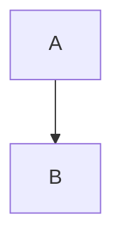

# Content Types

This document defines the content type contracts for semops-sites. Content is authored in semops-publisher and ingested into semops-sites using the ingestion script.

## Ingestion Workflow

```text
semops-publisher (Markdown)                    semops-sites (MDX)
──────────────────────────────────────────────────────────────
content/pages/<hub>/*.md              →    apps/<app>/content/pages/*.mdx
posts/<slug>/final.md                 →    apps/<app>/content/blog/*.mdx
content/whitepapers/<slug>/<slug>.md  →    apps/<app>/content/whitepapers/*.mdx
```

**Command:**

```bash
# Ingest pages
npm run ingest -- pages <hub-slug> --app <semops|timjmitchell>

# Ingest blog
npm run ingest -- blog <slug> --app <semops|timjmitchell>

# Ingest whitepaper
npm run ingest -- whitepaper <slug> --app <semops|timjmitchell>

# Options
--dry-run        Preview without writing
--category       Override derived category (blog only)
--source         Override semops-publisher path
```

## Type Contracts

### Blog Posts

**Directory:** `apps/<app>/content/blog/`
**File format:** `<slug>.mdx`

**Frontmatter (BlogFrontmatter):**

| Field | Type | Required | Description |
| ----- | ---- | -------- | ----------- |
| `title` | string | Yes | Post title |
| `date` | string | Yes | Publication date (YYYY-MM-DD) |
| `author` | string | Yes | Author name |
| `category` | string | Yes | Content category (e.g., "Industry", "Technical") |
| `tags` | string[] | Yes | Topic tags |
| `excerpt` | string | Yes | Brief summary for listings |

**Example:**

```yaml
---
title: "How I Got Here"
date: "2026-02-06"
author: "Tim Mitchell"
category: "Industry"
tags: ["AI", "SemOps", "Career"]
excerpt: "A product manager's journey from sabbatical to building the Semantic Operations Framework."
---
```

**Routing:** `/blog/[slug]`

### Pages

**Directory:** `apps/<app>/content/pages/`
**File format:** `<slug>.mdx`

**Frontmatter (PageFrontmatter):**

| Field | Type | Required | Description |
| ----- | ---- | -------- | ----------- |
| `title` | string | Yes | Page title |
| `description` | string | Yes | SEO description |

**Example:**

```yaml
---
title: "What is Semantic Operations?"
description: "SemOps is a practical framework for businesses to align technology and organization for data, AI, and agentic systems."
---
```

**Routing:** Determined by App Router structure (see Hub/Spoke below)

### Whitepapers

**Directory:** `apps/<app>/content/whitepapers/`
**File format:** `<slug>.mdx`

**Frontmatter (WhitepaperFrontmatter):**

| Field | Type | Required | Description |
| ----- | ---- | -------- | ----------- |
| `title` | string | Yes | Whitepaper title |
| `description` | string | Yes | SEO description |
| `abstract` | string | No | Extended summary |
| `author` | string | Yes | Author name |
| `date` | string | Yes | Publication date (YYYY-MM-DD) |
| `version` | string | No | Version identifier (e.g., "v2") |
| `tags` | string[] | Yes | Topic tags |

**Example:**

```yaml
---
title: "Semantic Operations: Building AI-Ready Organizations"
description: "A practical framework for transforming semantic debt into sustainable competitive advantage."
abstract: |
  Organizations investing in AI face a structural problem: the systems meant to
  accelerate decisions often can't agree on what the data means.
author: "Tim Mitchell"
date: "2026-01-19"
version: "v2"
tags: ["semops", "framework", "ai-integration", "whitepaper"]
---
```

**Routing:** `/whitepapers/[slug]`

**Features:**

- Abstract displayed in highlighted box
- PDF download button (planned)
- Tags displayed at bottom

## Hub/Spoke Page Structure

Pages use a hub/spoke pattern for hierarchical content.

| Role | Example | Route |
| ---- | ------- | ----- |
| Hub | `what-is-semops.mdx` | `/about` |
| Spoke | `how-i-got-here.mdx` | `/about/how-i-got-here` |
| Hub | `framework.mdx` | `/framework` |
| Spoke | `strategic-data.mdx` | `/framework/strategic-data` |
| Spoke | `explicit-architecture.mdx` | `/framework/explicit-architecture` |
| Spoke | `semantic-optimization.mdx` | `/framework/semantic-optimization` |

Blog posts that relate to a hub are linked via absolute routes (e.g., `/blog/how-i-got-here`) rather than being classified as spokes.

**Hub route mapping (in ingestion script):**

```typescript
const HUB_ROUTE_CONFIG = {
  "what-is-semops": { route: "/about" },
  "framework": { route: "/framework" },
  "strategic-data": { route: "/framework/strategic-data" },
  "explicit-architecture": { route: "/framework/explicit-architecture" },
  "semantic-optimization": { route: "/framework/semantic-optimization" },
};
```

The ingestion script converts relative links:

- `[text](why-semops.md)` → `[text](/about/why-semops)`
- `[text](framework.md#anchor)` → `[text](/framework#anchor)`
- `[text](strategic-data.md)` → `[text](/framework/strategic-data)`

## Content Images

Content images (diagrams, figures referenced in MDX) are stored in each app's `public/images/` directory:

```text
apps/<app>/public/
├── images/              # Content images (diagrams, figures)
│   └── semantic-funnel.svg
└── logos/               # Brand assets (logos, icons)
```

**In semops-publisher source:** Reference images with absolute paths that map to the app's public directory:

```markdown

```

The ingestion pipeline passes image references through unchanged (they start with `/` so they're treated as local assets).

## Available MDX Components

### MermaidDiagram

Renders Mermaid diagrams client-side.

**Props:**

- `chart` (string, required): Mermaid diagram definition

**Usage:**

```jsx
<MermaidDiagram chart={`flowchart TD
    A[Start] --> B{Decision}
    B -->|Yes| C[End]
    B -->|No| A`} />
```

**Supported diagram types:**

- Flowcharts (TD, LR, etc.)
- Sequence diagrams
- Entity-Relationship diagrams
- State diagrams
- Class diagrams
- Gantt charts

The ingestion script automatically converts Mermaid code blocks:

````markdown

````

becomes:

```jsx
<MermaidDiagram chart={`graph TD
    A --> B`} />
```

## Type Definitions

Types are defined in `apps/<app>/src/types/blog.ts`:

```typescript
interface BlogFrontmatter {
  title: string;
  date: string;
  author: string;
  category: string;
  tags: string[];
  excerpt: string;
}

interface PageFrontmatter {
  title: string;
  description: string;
}

interface WhitepaperFrontmatter {
  title: string;
  description: string;
  abstract?: string;
  author: string;
  date: string;
  version?: string;
  tags: string[];
}
```

## Category Derivation

For blog posts, category is derived from tags using a priority mapping:

| Tag | Category |
| --- | -------- |
| semops, ai-integration, career, product-management, mental-models | Industry |
| testing, mdx, technical | Technical |
| (default) | Industry |

Override with `--category` flag:

```bash
npm run ingest -- blog my-post --category "Technical"
```

## Apps

| App | Directory | Purpose |
| --- | --------- | ------- |
| semops | `apps/semops/` | semops.ai - product/consulting |
| timjmitchell | `apps/timjmitchell/` | timjmitchell.com - personal site |

Both apps use identical type definitions and MDX processing pipelines.
